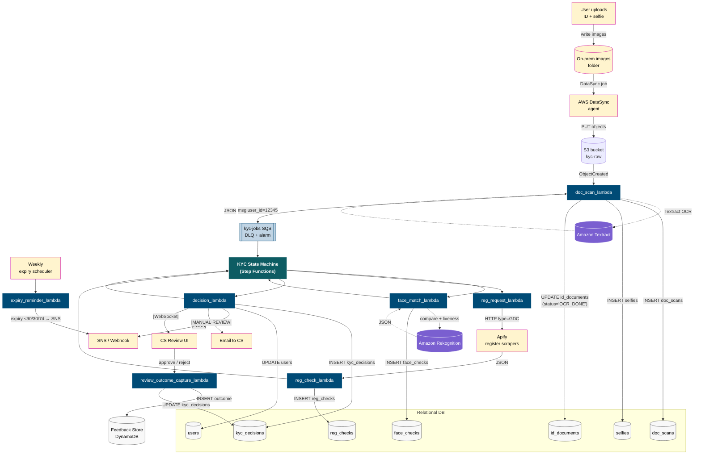

# KYC_platform_step_functions


End‑to‑end Know‑Your‑Customer (KYC) flow built on **AWS Lambda, SQS, Textract, Rekognition, RDS (PostgreSQL)** and **Apify**.  This repository contains:

* Live architecture and data‑flow diagrams
* A step‑by‑step processing table with example payloads
* Patch SQL to bring the schema up

---

## 📁 Quick Links

| Artifact                          | File                                                 |
| --------------------------------- | ---------------------------------------------------- |
| AWS CloudFormation template | [`infrastructure.yml`](./infrastructure.yml)             |
| Schema patch SQL                  | [`Kyc_Schema_Patch.sql`](./Kyc_Schema_Patch.sql) |

---

## 1  High‑Level Component Diagram

```mermaid
%%  KYC platform – component diagram
graph TD

    %% ─────────  EXTERNAL ACTORS  ─────────
    subgraph "External Actors"
        CSUI["CS Review UI"]
        User["User / Browser"]
    end

    %% ─────────  AWS KYC PLATFORM  ───────
    subgraph "KYC Platform (AWS account)"
        direction TB

        S3[(S3 Bucket<br/>kyc-raw/<br/>SSE-KMS + ObjectLock + VPC Endpoint)]:::store

        KycJobsQ[[kyc-jobs SQS<br/>+ DLQ + Alarm]]:::queue

        DocScan[[doc_scan_lambda<br/>+ X-Ray + Logs]]:::lambda
        ReqMaker[[reg_request_lambda<br/>+ X-Ray + Logs]]:::lambda
        FaceMatch[[face_match_lambda<br/>+ X-Ray + Logs]]:::lambda
        RegCheck[[reg_check_lambda<br/>+ X-Ray + Logs]]:::lambda
        Decision[[decision_lambda<br/>+ X-Ray + Logs]]:::lambda
        Expiry[[expiry_reminder_lambda<br/>+ X-Ray + Logs]]:::lambda

        StepFn["KYC State&nbsp;Machine<br/>(Step&nbsp;Functions)"]:::stepfn

        DB[(RDS PostgreSQL<br/>w/ Proxy & Read Replica)]:::store
        AuditLog[(Audit Trail DB<br/>Structured Logs to OpenSearch)]:::store
    end

    %% ─────────  SQL02 ON-PREM / EDGE  ─────────
    subgraph "SQL02 On-prem"
        OnPremSvc["onprem_upload_service"]:::lambda
        DataSyncAgent["AWS DataSync Agent"]:::source
    end

    %% ─────────  REGISTERS / APIFY  ───────
    subgraph APIFY_BOX["Registers / Apify scrapers"]
        direction TB
        ApifyGDC["GDC Register Scraper"]
        ApifyNMC["NMC Register Scraper"]
        ApifyGMC["GMC Register Scraper"]
        ApifyGPC["GPC Register Scraper"]
        RegCache["Register Cache (DynamoDB + TTL)"]:::store
    end

    %% ─────────  AWS AI SERVICES  ─────────
    subgraph "AWS AI services"
        direction TB
        Textract[(Amazon Textract<br/>via VPC Endpoint)]:::ai
        Rekog[(Amazon Rekognition<br/>via VPC Endpoint)]:::ai
        Textract -. "layout (no data)" .-> Rekog  
    end

    %% ─────────  NOTIFICATION  ───────────
    subgraph "Notifications"
        direction TB
        NotifySNS["SNS / Webhook"]
        NotifyEmail["Email to CS"]
        NotifySNS -. "layout (no data)" .-> NotifyEmail
    end

    %% ─────────  FEEDBACK LOOP  ─────────
    subgraph "Manual Review Feedback"
        FeedbackSvc["Review Outcome Capture Lambda"]
        FeedbackDB["Feedback Store (DynamoDB)"]:::store
    end

    %% ─────────  FLOWS ─────────
    User -->|"PUT ID & selfie"| OnPremSvc
    OnPremSvc -- "copy files" --> DataSyncAgent
    DataSyncAgent -->|"PUT objects"| S3

    S3 -- "ObjectCreated" --> DocScan
    DocScan --> Textract
    Textract --> DocScan
    DocScan --> DB
    DocScan --> KycJobsQ
    KycJobsQ --> StepFn

    StepFn --> FaceMatch
    FaceMatch --> Rekog
    Rekog --> FaceMatch
    FaceMatch --> DB
    FaceMatch --> StepFn

    StepFn --> ReqMaker
    ReqMaker -- "type = GDC" --> ApifyGDC
    ReqMaker -- "type = NMC" --> ApifyNMC
    ReqMaker -- "type = GMC" --> ApifyGMC
    ReqMaker -- "type = GPC" --> ApifyGPC

    %% each scraper writes downward into the cache
    ApifyGDC --> RegCache
    ApifyNMC --> RegCache
    ApifyGMC --> RegCache
    ApifyGPC --> RegCache
    RegCache --> ReqMaker
    ReqMaker --> StepFn

    StepFn --> RegCheck
    RegCheck --> DB
    RegCheck --> StepFn

    StepFn --> Decision
    Decision --> DB
    Decision --> NotifySNS
    Decision --> NotifyEmail
    Decision --> CSUI
    Decision --> AuditLog

    CSUI --> FeedbackSvc
    FeedbackSvc --> FeedbackDB

    Expiry --> DB
    Expiry --> NotifyEmail
    Expiry --> User

    %% ─────────  STYLING  ─────────
    classDef lambda fill:#004B76,stroke:#fff,color:#fff;
    classDef queue  fill:#C0D4E4,stroke:#004B76,color:#000;
    classDef store  fill:#F8F8F8,stroke:#555,color:#000;
    classDef source fill:#FFF4CE,stroke:#C09,color:#000;
    classDef ai     fill:#7A5FD0,stroke:#fff,color:#fff;
    classDef stepfn fill:#0D5C63,stroke:#fff,color:#fff,font-weight:bold;

    class OnPremSvc,DocScan,ReqMaker,FaceMatch,RegCheck,Decision,Expiry,FeedbackSvc lambda;
    class KycJobsQ queue;
    class S3,DB,AuditLog,FeedbackDB,RegCache store;
    class DataSyncAgent source;
    class Textract,Rekog ai;
    class StepFn stepfn;
```



---

## 2  Detailed Flow Diagram



---

## 3  Process Step Descriptions (Enum-Aligned)

<details>
<summary>Click to expand step‑by‑step table</summary>

| Step     | Trigger / Source                        | Service (State-Machine Task)                                 | Action                                                         | DB Writes                                                                             | Example Columns / Notes                                                                     | Next                                    |     |       |                   |
| -------- | --------------------------------------- | ------------------------------------------------------------ | -------------------------------------------------------------- | ------------------------------------------------------------------------------------- | ------------------------------------------------------------------------------------------- | --------------------------------------- | --- | ----- | ----------------- |
| **0**    | User uploads ID & selfie → on-prem → S3 | `onprem_upload_service`                                      | Accept files, create user/doc rows                             | `users` INSERT<br>`id_documents` INSERT (`status='NEW'`)                              | `email=dr.jane@example.com`<br>`reg_no=6143219`<br>`doc_type=passport`                      | —                                       |     |       |                   |
| **1**    | **`S3:ObjectCreated`**                  | `doc_scan_lambda`                                            | Run Textract OCR, parse metadata                               | `doc_scans` INSERT<br>`selfies` INSERT<br>`id_documents` UPDATE (`status='OCR_DONE'`) | `parsed_name=JANE ANN DOE`<br>`parsed_expiry=2032-05-01`                                    | → **put message** on **`kyc-jobs` SQS** |     |       |                   |
| **2**    | **`kyc-jobs` SQS**                      | **KYC State Machine (Step Functions)**<br>*Execution starts* | Orchestrate KYC checks with retries, time-outs & audit history | —                                                                                     | Input contains `user_id`, parsed doc data                                                   | **2a** & **2b** run in parallel         |     |       |                   |
| **2a**   | Step Functions task                     | `face_match_lambda`                                          | Rekognition face-match & liveness                              | `face_checks` INSERT                                                                  | `match_score=0.93`<br>`liveness_pass=true`                                                  | Wait for **2b**                         |     |       |                   |
| **2b-1** | Step Functions task                     | `reg_request_lambda`                                         | Choose scraper based on `type`, invoke Apify (async)           | —                                                                                     | \`type=GDC                                                                                  | NMC                                     | GMC | GPC\` | Wait for callback |
| **2b-2** | Apify HTTP callback → Step Functions    | `reg_check_lambda`                                           | Store register result                                          | `reg_checks` INSERT                                                                   | `matched_name=true`<br>`matched_status=true`                                                | Wait for **2a**                         |     |       |                   |
| **2c**   | Step Functions task                     | `decision_lambda`                                            | Aggregate all signals, decide PASS / MANUAL / FAIL             | `kyc_decisions` INSERT<br>`users` UPDATE                                              | `decision=PASS`<br>`status=VERIFIED`                                                        | SNS → 3 channels                        |     |       |                   |
| **2d**   | Step Functions task                     | (integrated)                                                 | Publish result                                                 | —                                                                                     | Sends to:<br>• **SNS / Webhook**<br>• **Email to CS**<br>• **CS Review UI** (WebSocket/SSE) | —                                       |     |       |                   |
| **3**    | Manual override in CS UI                | —                                                            | CS agent approves / rejects                                    | `kyc_decisions` UPDATE<br>`users` UPDATE                                              | —                                                                                           | —                                       |     |       |                   |
| **4**    | Weekly CloudWatch rule                  | `expiry_reminder_lambda`                                     | Email users whose IDs expire in 90 / 30 / 7 days               | *(read-only)*                                                                         | —                                                                                           | Notify topic                            |     |       |                   |

</details>

---

## 4  Entity‑Relationship Diagram


---

### Running Locally

```bash
psql $DB_URL -f "Kyc_Schema_Patch.sql"
```

---

### Contributing

PRs welcome – please update diagrams + docs if queue names, enum values, or DB tables change.
