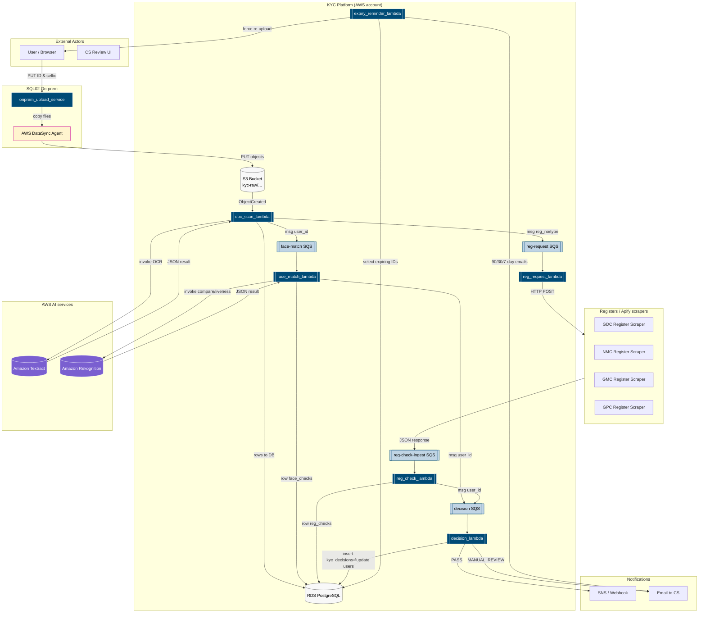
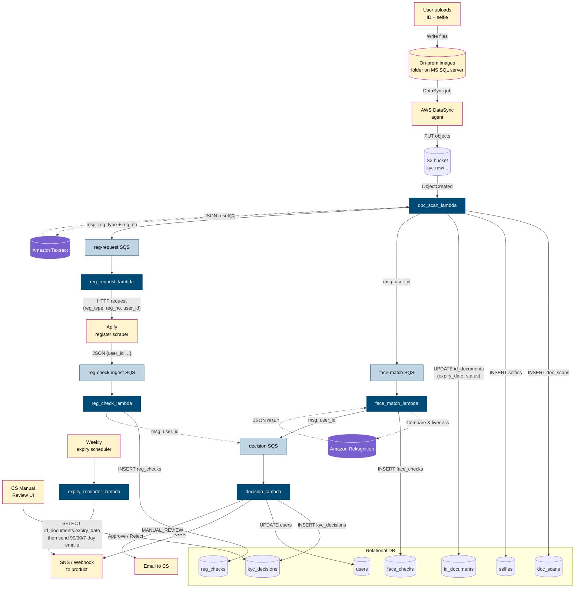
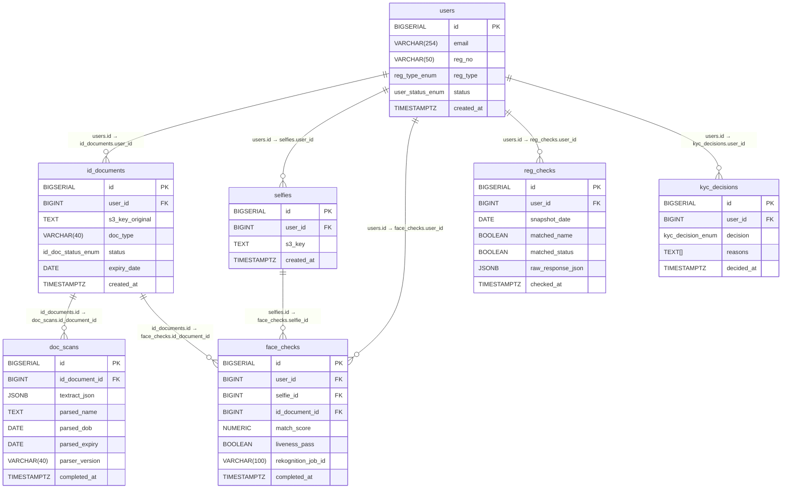

# KYC_platform_step_functions


End‑to‑end Know‑Your‑Customer (KYC) flow built on **AWS Lambda, SQS, Textract, Rekognition, RDS (PostgreSQL)** and **Apify**.  This repository contains:

* Live architecture and data‑flow diagrams
* A step‑by‑step processing table with example payloads
* Patch SQL to bring the schema up

---

## 📁 Quick Links

| Artifact                          | File                                                 |
| --------------------------------- | ---------------------------------------------------- |
| AWS CloudFormation template | [`infrastructure.yml`](./infrastructure.yml)             |
| Schema patch SQL                  | [`Kyc_Schema_Patch.sql`](./Kyc_Schema_Patch.sql) |

---

## 1  High‑Level Component Diagram



---

## 2  Detailed Flow Diagram



---

## 3  Process Step Descriptions (Enum-Aligned)

<details>
<summary>Click to expand step‑by‑step table</summary>

| Step   | Trigger / Source                        | Service                  | Action                            | DB Writes                                                       | Example Columns                                                                                                        | Next                                  |
| ------ | --------------------------------------- | ------------------------ | --------------------------------- | --------------------------------------------------------------- | ---------------------------------------------------------------------------------------------------------------------- | ------------------------------------- |
| **0**  | User uploads ID & selfie → on-prem → S3 | `onprem_upload_service`  | Accept files, create user/doc     | `users` INSERT<br>`id_documents` INSERT (`status='NEW'`)        | - `email = dr.jane@example.com`<br>- `reg_no = 6143219`<br>- `status = PENDING`<br>- `doc_type = passport`             | *(none)*                              |
| **1**  | `S3:ObjectCreated` event                | `doc_scan_lambda`        | Textract OCR, parse metadata      | `doc_scans` INSERT<br>`selfies` INSERT<br>`id_documents` UPDATE | - `parsed_name = JANE ANN DOE`<br>- `parsed_dob = 1985-02-14`<br>- `parsed_expiry = 2032-05-01`<br>- `status = OCR_DONE` | `face-match` SQS<br>`reg-request` SQS |
| **2**  | SQS: face-match                         | `face_match_lambda`      | Rekognition face + liveness check | `face_checks` INSERT                                            | - `match_score = 0.93`<br>- `liveness_pass = true`                                                                     | `decision` SQS                        |
| **3**  | SQS: reg-request                        | `reg_request_lambda`     | Call Apify scraper (async)        | —                                                               | —                                                                                                                      | *(wait Apify)*                        |
| **3a** | Apify returns result                    | *(Apify)*                | Publish response to SQS           | —                                                               | —                                                                                                                      | `reg-check-ingest` SQS                |
| **3b** | SQS: reg-check-ingest                   | `reg_check_lambda`       | Store register results            | `reg_checks` INSERT                                             | - `matched_name = true`<br>- `matched_status = true`                                                                   | `decision` SQS                        |
| **4**  | SQS: decision                           | `decision_lambda`        | Aggregate and decide KYC result   | `kyc_decisions` INSERT<br>`users` UPDATE                        | - `decision = PASS`<br>- `status = VERIFIED`                                                                           | SNS / Email                           |
| **5**  | Manual override                         | —                        | CS approves / rejects             | `kyc_decisions` UPDATE<br>`users` UPDATE                        | —                                                                                                                      | —                                     |
| **6**  | Weekly CloudWatch Event                 | `expiry_reminder_lambda` | Notify about expiring IDs         | *(read-only)*                                                   | - IDs within 90/30/7 days                                                                                              | Notify topic                          |

</details>

---

## 4  Entity‑Relationship Diagram



---

### Running Locally

```bash
psql $DB_URL -f "Kyc_Schema_Patch.sql"
```

---

### Contributing

PRs welcome – please update diagrams + docs if queue names, enum values, or DB tables change.
